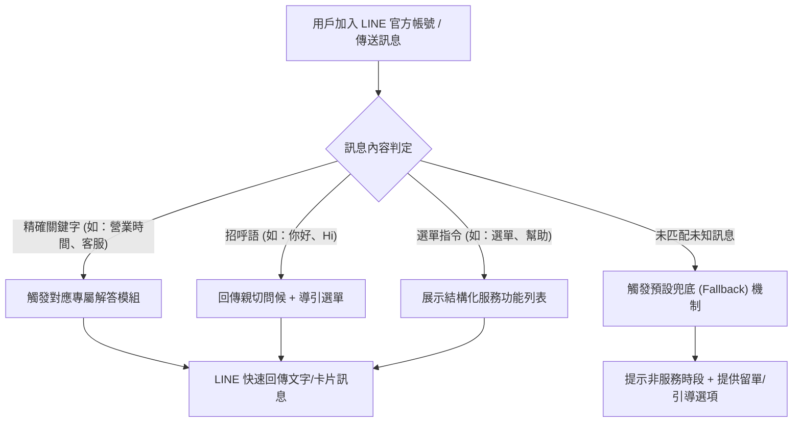
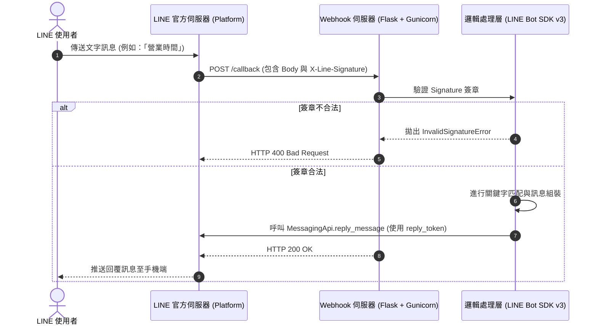
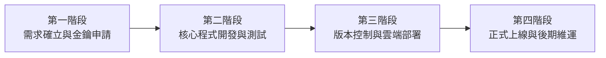

# LINE 智慧客服自動回覆機器人專案企劃書
**Project Proposal & System Specification: LINE Automated Customer Service Bot**

---

## 1. 專案執行摘要 (Executive Summary)

### 1.1 專案背景
隨著即時通訊軟體普及，LINE 已成為台灣覆蓋率最高（超過 90% 滲透率）的通訊平台與商業觸角。然而，許多企業與創作者在日常營運中面臨以下痛點：
1. **非上班時段溝通斷層**：夜間與假日時段無法即時回應用戶諮詢，造成大量潛在客戶流失。
2. **客服人力成本高昂**：超過 70% 的進線問題屬於「重複性高、答案固定」的基礎諮詢（如營業時間、商品下單方式、常見問題等）。
3. **回覆標準化程度不足**：人工回覆品質易受人員情緒或熟練度影響，缺乏統一的話術與規範。

### 1.2 專案目標與預期效益
本專案旨在透過 LINE Messaging API 結合 Python 輕量化後端架構，打造一個具備高可用性、安全可靠的 **24/7 自動回覆機器人**。
* **縮短等待時間**：由傳統平均數小時的人工等待，降至「秒級（< 1 秒）」即時回應。
* **降低客服負荷**：自動消化 70% 以上的高頻常規問題，讓人工客服專注處理高價值與複雜個案。
* **提升品牌專業度**：建立標準化服務流程，並支援後續無縫銜接生成式 AI（如 Google Gemini / OpenAI）與資料庫系統。

---

## 2. 目標受眾與使用場景 (Target Audience & Scenarios)

### 2.1 目標受眾分類
| 受眾類型 | 核心特徵 | 主要需求與期望行為 |
| :--- | :--- | :--- |
| **初次訪客 / 新好友** | 剛加入官方帳號，對品牌或服務缺乏了解 | 獲取歡迎資訊、服務目錄、新戶優惠碼 |
| **潛在購買者** | 正在評估產品或服務，有時效性疑問 | 查詢營業時間、購買流程、價目表、活動資訊 |
| **既有用戶 / 售後者** | 已消費或遇到使用問題 | 查詢常見問題（FAQ）、尋求真人客服支援管道 |

### 2.2 使用者旅程圖 (User Journey)

---

## 3. 系統功能規格規劃 (System Functional Specifications)

### 3.1 核心功能模組

#### 模組 A：關鍵字自動匹配系統 (Keyword Matching Engine)
* **迎賓問候識別**：支援「你好」、「嗨」、「哈囉」、「Hello」、「Hi」等常見招呼語，自動回覆客製化歡迎詞並提示功能選單。
* **功能選單導覽**：支援「選單」、「目錄」、「幫助」、「help」等指令，回傳清單式文字或圖文導覽。
* **常見資訊解答**：
  * 「營業時間」：即時回覆服務時段、公休日與服務說明。
  * 「客服」：提供免付費電話、客服信箱及真人對接提示。
  * 「常見問題」：條列最核心的 FAQ 問答（如配送時效、退換貨標準等）。
  * 「最新活動」：發布當期促銷折扣碼或優惠活動資訊。

#### 模組 B：預設兜底機制 (Fallback & Exception Handler)
* 當用戶輸入不在關鍵字庫內的非預期內容時，系統不會沉默或當機，而是自動觸發友善提示。
* 告知目前非人工即時在線時段，並引導用戶輸入「選單」查看快捷資訊，或留下問題待上班時間處理。

#### 模組 C：安全驗證與防偽機制 (Security & Verification)
* **X-Line-Signature 驗證**：利用 `HMAC-SHA256` 演算法校驗每一筆來自 LINE 伺服器的 HTTP 請求，徹底防範中間人偽造與未授權竄改。
* **環境變數分離**：核心金鑰（Channel Secret、Channel Access Token）與原始碼嚴格隔離，透過 `.env` 檔載入，並在 `.gitignore` 排除，確保開源或推送至 GitHub 時零風險。

---

## 4. 技術架構與系統設計 (Technical Architecture)

### 4.1 系統架構圖 (Architecture Overview)

### 4.2 技術棧選型 (Tech Stack)

| 層級 | 推薦技術 | 選型理由 |
| :--- | :--- | :--- |
| **開發語言** | Python 3.10+ | 語法簡潔、生態系成熟、未來極易無縫整合 AI / 機器學習模型 |
| **Web 框架** | Flask 3.x | 輕量化、極低記憶體開銷、啟動速度快，極適合作為 Webhook 微服務 |
| **官方 SDK** | line-bot-sdk v3 | 官方最新維護版本，支援嚴格型別校驗與最新 API 特性 |
| **WSGI 容器** | Gunicorn | 生產環境必備，提供多 Worker 程序處理並行請求，保證服務穩定性 |
| **程式碼託管** | GitHub | 現代版本控制標準，具備分支管理、CI/CD 整合與團隊協同能力 |
| **雲端部署平台** | Render / Railway | 提供免費/低成本方案，支援 GitHub 推送自動重啟部署 (GitOps) |

---

## 5. 專案時程與里程碑規劃 (Project Timeline & Milestones)

本專案採敏捷開發模式，分為四個主要階段：

| 階段 | 重點任務 | 產出成果 | 狀態 |
| :--- | :--- | :--- | :---: |
| **階段一** | 申請 LINE Developers Messaging API、建立官方帳號、取得金鑰 | Channel Secret、Channel Access Token | ✅ **已完成** |
| **階段二** | 撰寫 Flask 伺服器、串接 SDK v3、撰寫關鍵字回覆邏輯、配置環境變數 | `app.py`, `.env`, `requirements.txt` | ✅ **已完成** |
| **階段三** | Git 環境安裝、初始化 Repository、推送至 GitHub、部署至雲端 (Render) | GitHub 倉庫、可公開存取的 HTTPS Webhook | 🔄 **進行中** |
| **階段四** | Webhook 連線驗證、端到端真機測試、上線營運、收集使用者常問問題 | 正式穩定運行的 LINE 自動回覆服務 | ⏳ **待執行** |

---

## 6. 風險評估與防範對策 (Risk Management)

| 潛在風險 | 風險等級 | 影響說明 | 因應與防範策略 |
| :--- | :---: | :--- | :--- |
| **金鑰外洩風險** | **高** | Channel Secret 或 Token 被惡意第三方盜用發送垃圾訊息 | 採用 `.gitignore` 嚴格過濾 `.env`，若發生外洩立即於後台執行 `Reissue`。 |
| **Webhook 逾時中斷** | **中** | LINE 要求 Webhook 需於短時間內回傳 HTTP 200，逾時將判定失敗 | 回覆邏輯避免同步阻塞操作；若日後串接耗時 AI API，採用背景異步處理。 |
| **免費額度超額** | **低** | LINE 官方帳號有每月免費主動推播 (Push) 則數上限 | **本系統全數採用「回覆 (Reply)」模式**，LINE 官方對 Reply 訊息免計入推播收費額度！ |
| **雲端主機休眠 (Cold Start)** | **低** | 免費雲端平台長時間無流量可能休眠，首次喚醒需 20~30 秒 | 可使用免費 Uptime 監控工具（如 UptimeRobot）每 10 分鐘 Ping 一次健康檢查端點 `/` 保持活水。 |

---

## 7. 未來擴展藍圖 (Future Roadmap)

1. **圖文選單整合 (Rich Menu)**：
   * 在 LINE 底部常駐 6 宮格或 4 宮格圖文選單，提供直覺的視覺化點擊體驗。
2. **生成式 AI 大腦串接 (LLM Integration)**：
   * 整合 **Google Gemini API** 或 **OpenAI GPT**，當遇到關鍵字無法匹配的長文本時，自動啟動 AI 生成精準、人性化的語意回覆。
3. **資料庫與客戶留單紀錄 (CRM)**：
   * 串接 SQLite / PostgreSQL 資料庫，記錄用戶諮詢歷史、常見偏好與聯絡資料，實現精準二次行銷。
